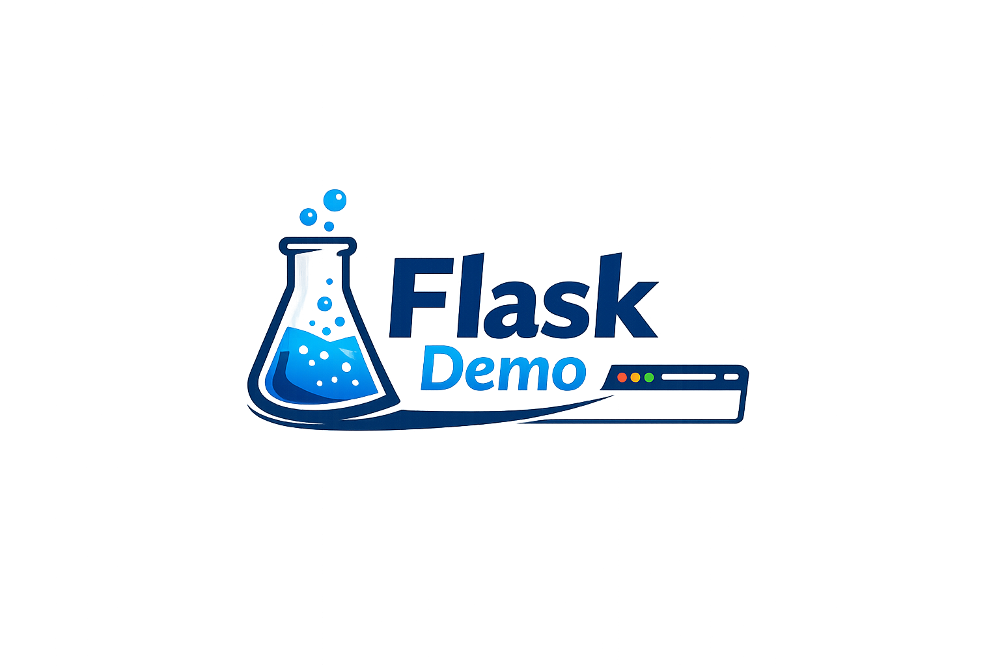

# 🔥 Flask WebApp Demo


A simple Flask web application showcasing static assets, templates, and multiple routes (/ and /about). This project demonstrates how to structure a Python web app with HTML, CSS, JavaScript, and images — perfect as a starter template or recruiter‑ready demo.

## 🎨 Screenshots

### Demo Logo

---
## 🚀 Quickstart
```bash
# Clone the repository
git clone https://github.com/obintui10/flask-webapp-demo.git
cd flask-webapp-demo

# Install dependencies
pip install -r requirements.txt

# Run the app
python app.py

## 📂 Project Structure
flask-webapp-demo/
│
├── app.py                # Flask app with routes
├── requirements.txt      # Dependencies
├── static/
│   ├── style.css         # Stylesheet
│   ├── app.js            # JavaScript
│   └── images/
│       └── flask-demo-logo.png
└── templates/
    ├── index.html        # Home page
    └── about.html        # About page

## 🛠 Tech Stack
- Flask → Python web framework
- HTML5 → Templates (index.html, about.html)
- CSS → Styling via static/style.css
- JavaScript → Interactivity via static/app.js
- Static assets → Logo image in static/images/

## 📖 Features
- Multiple routes → / and /about
- Static asset handling → CSS, JS, and images served correctly
- Responsive design → Mobile‑friendly templates
- Clean project structure → Recruiter‑ready layout


## 🏗 Architecture (Box Style)
┌───────────────────────────────┐
│           Browser             │
└───────────────┬───────────────┘
                │
                ▼
┌───────────────────────────────┐
│          Flask App            │
│   (app.py routes: /, /about)  │
└───────────────┬───────────────┘
                │
   ┌────────────┴────────────┐
   │                         │
   ▼                         ▼
┌───────────────┐     ┌────────────────┐
│   Templates    │     │    Static      │
│ (index.html,   │     │ (CSS, JS, Img) │
│  about.html)   │     │ style.css,     │
└───────────────┘     │ app.js, logo   │
                       └────────────────┘
```
## 🏗 Architecture (Mermaid)
```mermaid
flowchart TD
    A[Browser] --> B[Flask App]
    B --> C[Route: /]
    B --> D[Route: /about]
    C --> E[Template: index.html]
    D --> F[Template: about.html]
    B --> G[Static Assets: CSS, JS, Logo]


